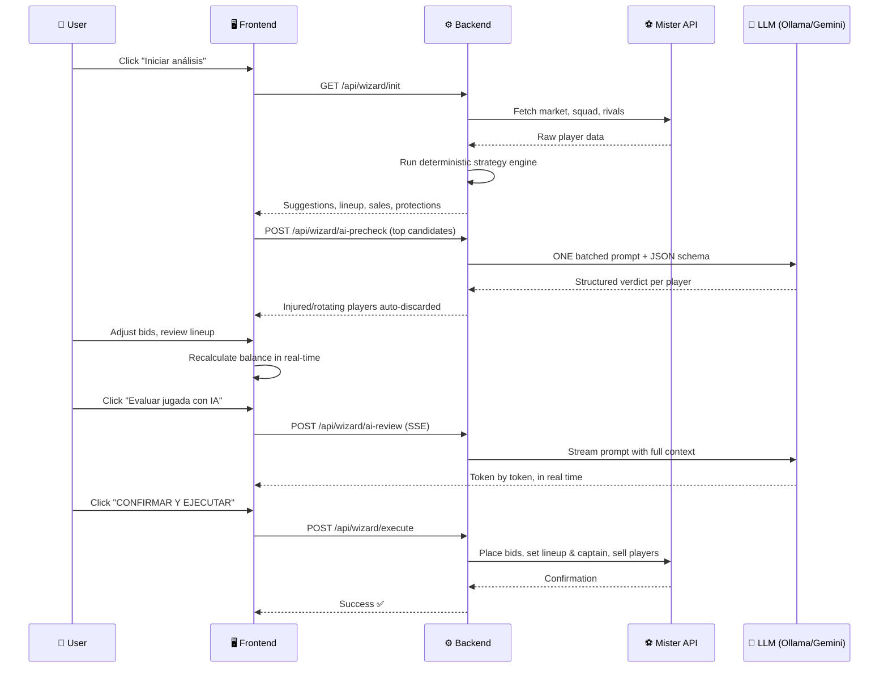

<p align="center">
  
</p>

<p align="center">
  
</p>

<p align="center">
  
</p>

<p align="center">
  <a href="#-features"></a>
  <a href="#%EF%B8%8F-architecture"></a>
  <a href="#-getting-started"></a>
  <a href="#-how-it-works"></a>
</p>

<p align="center">
  
  
  
  
  
  
</p>

---

## 🎯 What is this?

**Wolf of Football Field** is an AI copilot for [Mister Fantasy](https://mister.mundodeportivo.com/) — the most popular Fantasy Football platform in Spain. It connects to the official API, scrapes market data, analyzes player performance, and uses an LLM (local Ollama, with automatic Gemini cloud fallback) to make informed decisions about signings, sales, lineup optimization, and rival analysis.

> *"The only thing standing between you and your goal is the bullshit story you keep telling yourself as to why you can't achieve it."* — Except now, AI tells the story for you.

Instead of spending hours every matchday clicking through menus, you get a **5-step guided Wizard** that prepares your entire strategy in one go, lets you tweak it, and executes everything with a single click.

### Design philosophy: the LLM never does math

Every financial decision (bid premiums, buyout-clause caps, balance cushions) is **deterministic and rule-based** in `strategy.py`. The LLM is reserved for what it's actually good at: reading injury news, judging rotations, and giving a final tactical review of your plan. No 9B model is asked whether 4M > 70% of 5M.

---

## ✨ Features

<table>
<tr>
<td width="50%">

### 🧙 Guided Wizard Flow
A 5-step process that walks you through your entire matchday strategy:
1. **Init** — Downloads market, squad, and rival data
2. **Market** — Browse and select signings with live balance tracking
3. **Lineup** — Visual football pitch with your best XI and captain
4. **Sales & Protection** — Auto-sell deadweight, shield star players
5. **AI Review & Execute** — Final LLM evaluation before committing

</td>
<td width="50%">

### 🤖 Dual-Provider AI Layer
A provider abstraction (`llm_client.py`) talks to **local Ollama** first and falls back to **Google Gemini** (plain REST, no SDK) when Ollama is offline — for both single-shot and streaming generation. If neither is available, a keyword analyzer keeps the bot functional.

### 📋 Structured AI Output
Injury verdicts use **schema-constrained decoding** (Ollama `format` / Gemini `responseSchema`): the model can only answer with valid JSON. No regex archaeology on free-form text.

</td>
</tr>
<tr>
<td width="50%">

### 🩺 Batched Injury Pre-check
One LLM call audits the **entire market shortlist** at once: news snippets for every candidate are gathered from [futbolfantasy.com](https://futbolfantasy.com) and judged in a single inference. Wizard init takes seconds, not minutes.

### 🛡️ Player Protection
Automatically detects undervalued star players in your squad and suggests putting them on the market at 2x value to prevent rival steals (*clausulazos*).

</td>
<td width="50%">

### 📡 Streaming AI Review (SSE)
The final review streams Ollama/Gemini tokens to the browser via **Server-Sent Events** — you watch the AI "think" in real time. No timeouts, works with any league size.

### 💰 Smart Balance Management
The frontend cart **recalculates your projected balance in real time**. If you go negative, it automatically drops the lowest-scored bids until you're solvent again. *Sell high, buy low.*

</td>
</tr>
</table>

---

## 🏗️ Architecture

```
┌──────────────────────────────────────────────────────────┐
│                    FRONTEND (Angular 18)                  │
│                                                          │
│   Wizard UI ──► Shopping Cart ──► SSE Stream Reader      │
│       │              │                    │               │
│       ▼              ▼                    ▼               │
│   [Init] ──► [Market] ──► [Lineup] ──► [Sales] ──► [AI]  │
└────────────────────────┬─────────────────────────────────┘
                         │ HTTP / SSE
┌────────────────────────▼─────────────────────────────────┐
│                   BACKEND (FastAPI)                       │
│                                                          │
│   server.py ──── strategy.py ──── llm_checker.py         │
│   (endpoints)    (rule engine,    (news scraping,        │
│                   all the math)    batched verdicts)     │
│                                        │                  │
│   api.py                          llm_client.py           │
│   (Mister scraper/client)         (provider routing)      │
│       │                            │            │         │
│       ▼                            ▼            ▼         │
│   [Mister Fantasy API]      [Ollama local] [Gemini REST]  │
└──────────────────────────────────────────────────────────┘
```

| Layer | Technology | Purpose |
|-------|-----------|---------|
| **Frontend** | Angular 18, TypeScript, Vanilla CSS | Wizard UI, real-time balance, SSE stream consumer |
| **Backend** | Python 3.10+, FastAPI, SQLAlchemy | REST API, deterministic strategy engine, streaming proxy |
| **AI/LLM** | Ollama (local) + Gemini (fallback) | Injury analysis, rotation checks, final cart review |
| **Data** | SQLite, BeautifulSoup | Player history tracking, web scraping |
| **News** | DuckDuckGo Search | futbolfantasy.com filtered news scraping |

---

## 🚀 Getting Started

### Prerequisites

| Tool | Version | Required |
|------|---------|----------|
| Python | 3.10+ | ✅ |
| Node.js | 18+ | ✅ |
| Ollama | Latest | ⭐ Recommended (or a Gemini API key) |

### 1. Clone & Setup Backend

```bash
git clone https://github.com/your-username/wolf-of-football-field.git
cd wolf-of-football-field/backend

# Create virtual environment
python -m venv .venv
.\.venv\Scripts\activate  # Windows
# source .venv/bin/activate  # macOS/Linux

# Install dependencies
pip install -r requirements.txt

# Configure credentials
cp .env.example .env
# Edit .env with your Mister Fantasy tokens (see below)
```

### 2. Get Your Mister Fantasy Token

1. Log into [Mister Fantasy](https://mister.mundodeportivo.com/) in your browser
2. Open DevTools (`F12`) → **Network** tab
3. Click on any request and find the `X-Auth` header → That's your `MISTER_AUTH_TOKEN`
4. Copy the `Cookie` header into `MISTER_COOKIE`; your league ID is visible in the URL

### 3. Setup an AI Provider

```bash
# Option A (recommended): local Ollama — free and private
# Install from https://ollama.com, then:
ollama pull qwen3.5:9b

# Option B: Gemini cloud fallback — set GEMINI_API_KEY in .env
# (used automatically whenever Ollama is not running)
```

### 4. Start the Backend

```bash
cd backend
python server.py
# API running at http://localhost:8000
```

### 5. Start the Frontend

```bash
cd frontend
npm install
npm start
# Open http://localhost:4200
```

---

## 🔄 How It Works



---

## 🧪 Testing

```bash
# Backend (16 tests: strategy rules, HTML parsing, AI layer)
cd backend
pytest

# Frontend (component & service specs)
cd frontend
npx ng test --watch=false --browsers=ChromeHeadless
```

---

## 📁 Project Structure

```
wolf-of-football-field/
├── backend/
│   ├── server.py          # FastAPI application & endpoints
│   ├── api.py             # Mister Fantasy web scraper & API client
│   ├── strategy.py        # Deterministic decision engine (market, lineup, clauses)
│   ├── llm_client.py      # Provider abstraction: Ollama + Gemini fallback
│   ├── llm_checker.py     # News scraping + batched AI verdicts + SSE review
│   ├── db_orm.py          # SQLAlchemy ORM models
│   ├── main.py            # CLI mode (headless bot)
│   ├── tests/             # pytest suite
│   ├── requirements.txt
│   └── .env.example
├── frontend/
│   └── src/app/
│       ├── models.ts            # Shared domain types
│       ├── services/            # Typed HTTP service
│       └── pages/wizard/        # Wizard UI (ts / html / css)
├── docs/
│   └── wolf_hero.jpg      # Project hero image
├── LICENSE
├── CHANGELOG.md
└── README.md
```

---

## 🤝 Contributing

Contributions, issues, and feature requests are welcome! Feel free to open a PR or issue.

## 📄 License

Released under the [MIT License](LICENSE).

---

<p align="center">
  
</p>

<p align="center">
  <sub>Built with 🐺 energy and a lot of ⚽ by <a href="https://github.com/your-username">your-username</a></sub>
</p>
